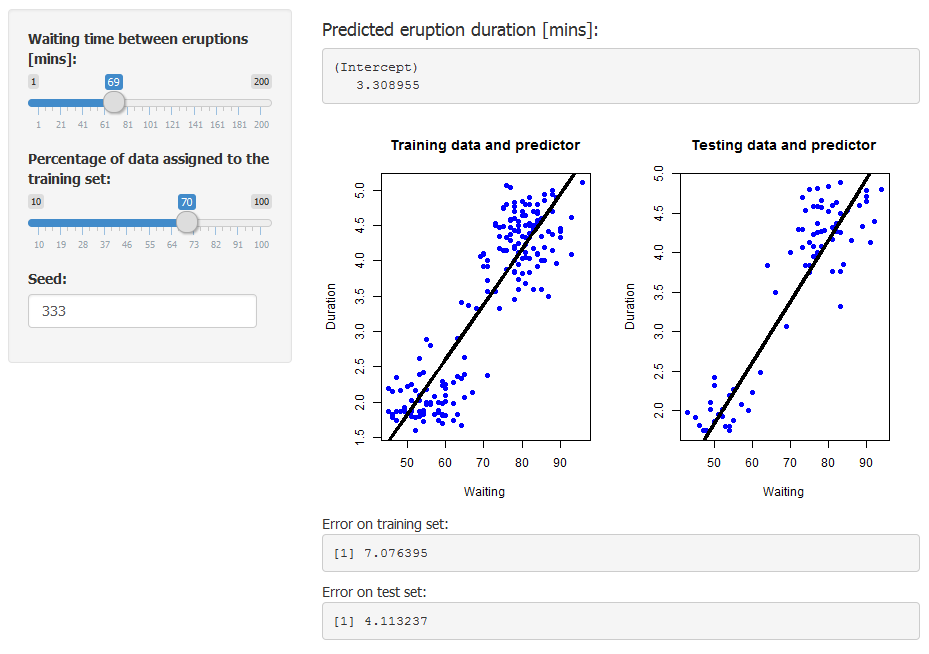

Predicting Old Faithful eruptions duration
========================================================
author: Maxime Jeanmart
date: Thu Apr 23 20:52:14 2015

The goal
========================================================

Usage: predict the duration of a geyser (Old Faithful, USA) eruption according
to the delay between this eruption and the last one.

Example (result in minutes):
- Waiting time = 8 minutes
- Seed = 333
- Ratio training set / test set = 0.5


```
(Intercept) 
  -1.201535 
```

The application
========================================================
Here is how the application looks like



User-defined parameters on the left, results on the right


Advanced parameters: seed
========================================================
- The user can set the seed he wants. Example:

```r
seed=333
oldfaithful(8, seed, 0.5)
```

```
(Intercept) 
  -1.201535 
```

```r
seed = 10
oldfaithful(8, seed, 0.5)
```

```
(Intercept) 
   -1.31971 
```

Advanced parameters: training ratio
========================================================
- The user can set the training vs test set ratio he wants. Example:

```r
ratio = .5
oldfaithful(8, 333, ratio)
```

```
(Intercept) 
  -1.201535 
```

```r
ratio = .7
oldfaithful(8, 333, ratio)
```

```
(Intercept) 
  -1.410985 
```
